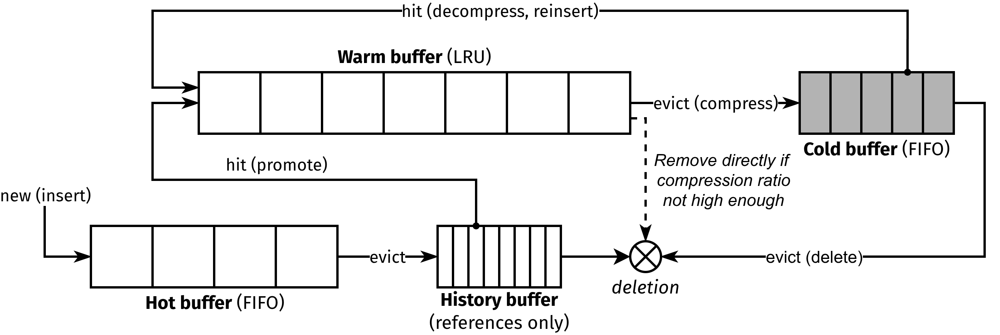
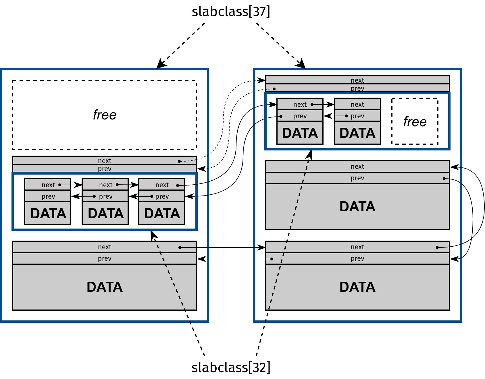

# PEQ-Memcached

Implementation of the **P**seudo-**E**lastic-**Q**ueue (PEQ) policy in Memcached.

PEQ consists of combining compression with the [2Q](https://www.vldb.org/conf/1994/P439.PDF) policy by applying it adaptively to a subset of warm items. We do this by dedicating a fraction of the warm buffer to a new buffer, which we call the cold buffer, where data are compressed. By doing so, the size of the cache is virtually increased.

# Building

To build memcached in your machine from local repo you will have to install
autotools, automake and libevent. In a debian based system that will look
like this

```
sudo apt-get install autotools-dev automake libevent-dev
```

After that you can build memcached binary using automake

```shell
cd peq-memcached
./autogen.sh
./configure
make
```

# Usage

PEQ options are specified using extended parameters (`-o` or `--extended`). They are as follows (they can be displayed using the `--help` option) :
- `compression_algo`: compression algorithm to use for the cold buffer. zstd (default), lz4, or snappy
- `min_compression_ratio`: minimum compression ratio for an item to be admited in the cold buffer (default: 2.00)
- `hist_buffer_capacity`: maximum number of item references that can be stored in the history buffer (default: `maxbytes / item_size_max`)
- `no_compression`: disable compression, equivalent to 2Q policy.

For example, to run peq with **512MB** of memory, using **lz4** compression with a minimum compression ratio of **3**, the command is as follows :

```shell
./memcached -m 512m -o compression_algo=lz4,min_compression_ratio=3
```

# Policy Overview

The cache is divided into three buffers: a **hot buffer** (FIFO), a **warm buffer** (LRU), and a **cold buffer** (where data are compressed). Newly inserted data are stored in the hot buffer. Long-term hot data are stored in the warm buffer, and recently evicted (from the warm buffer) data are compressed and stored in the cold buffer. The size of the cold buffer is dynamically adjusted as a percentage of the warm buffer, based on the trade-off between the gain from avoided misses and the penalty from penalized hits. The **history buffer** contains only the references of items recently evicted from the hot buffer and is used to identify which of those evicted items are accessed again, thus detecting warm items.

<p align="center">
    
</p>

# Memory management

when a compressed item needs to be stored, a smaller slab is created from the required smaller class using the data section of a free item. This minislab behaves like a normal slab and stores multiple compressed items. This way, compressed and uncompressed items can share the same memory page, making cache allocation more predictable and providing finer granularity than the conventional approach.

<p align="center">
    
</p>

This implementation is based on [Memcached-1.6.39](https://github.com/memcached/memcached/tree/1.6.39).